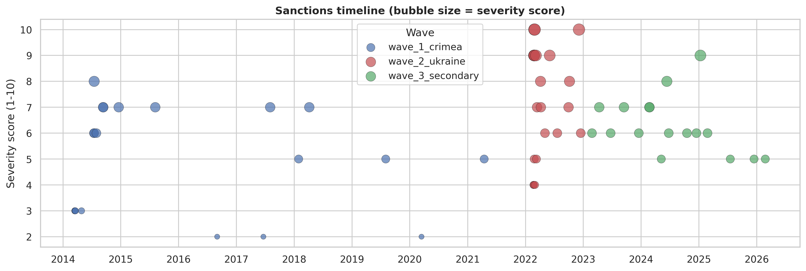
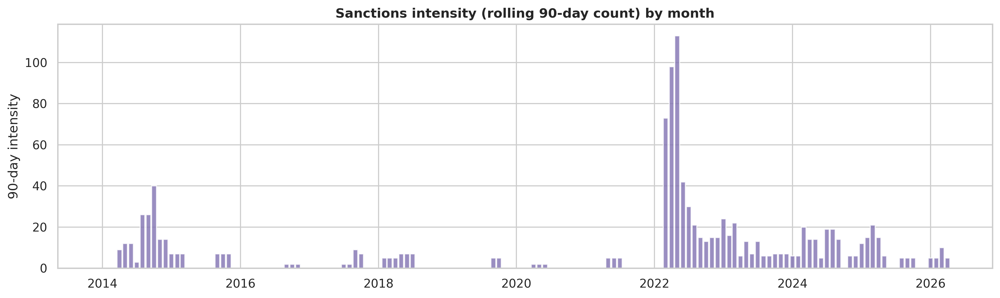
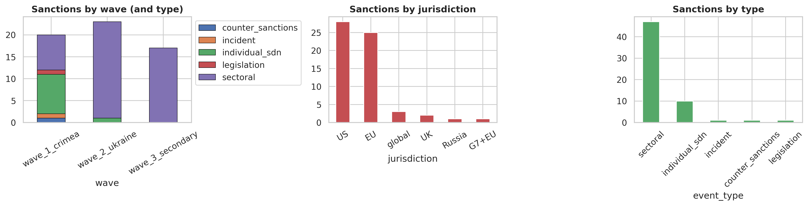
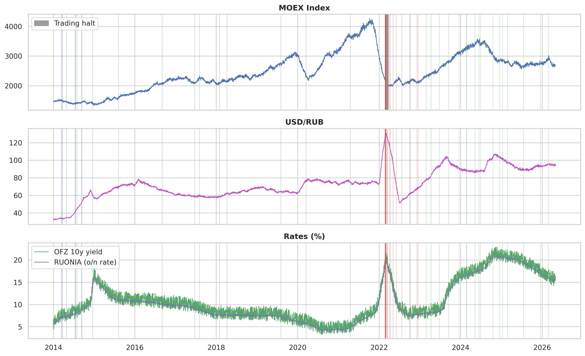
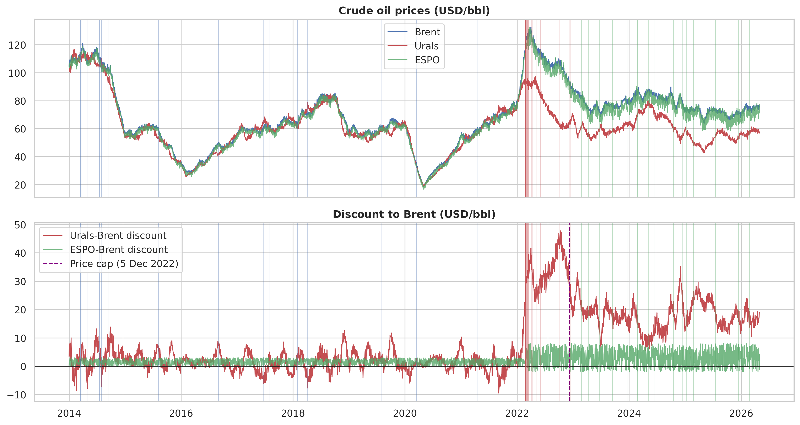
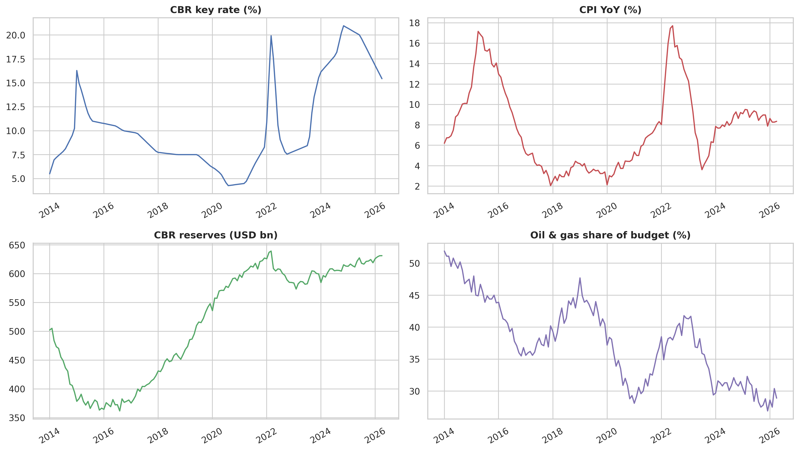
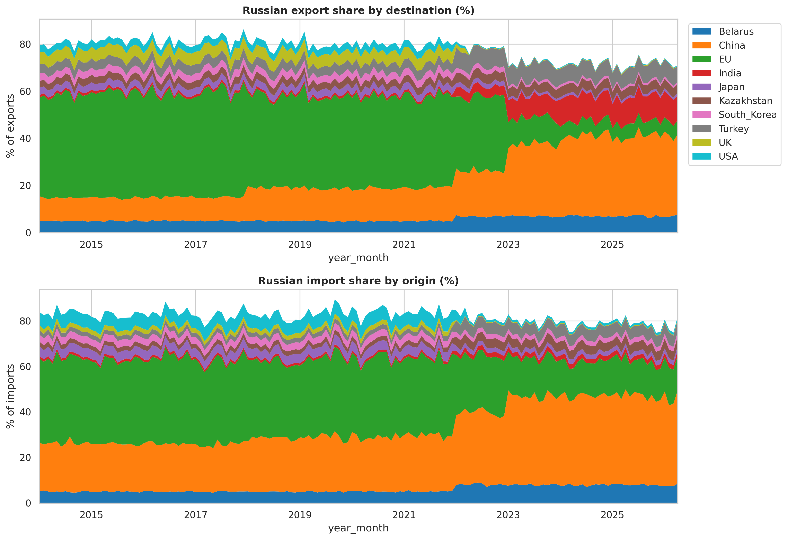
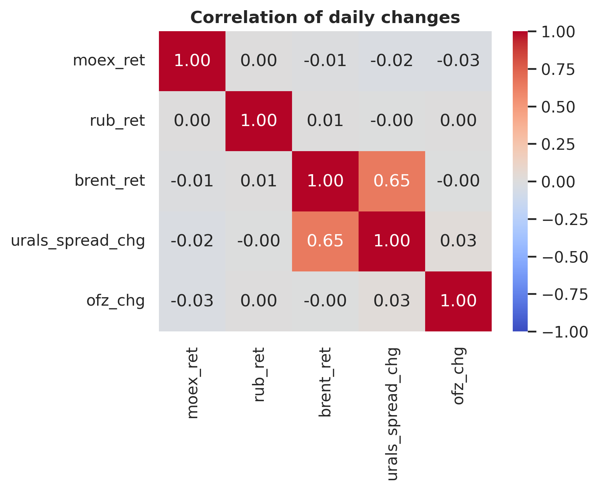

# **EDA Report: Russian Economy Under Sanctions, 2014–2026**

**Dataset:** 5 CSV files — `commodities_daily`, `equity_index_daily`, `macro_monthly`, `sanctions_events`, `trade_flows_monthly`  
**Date range:** January 2014 – April 2026  
**Analysis:** Exploratory Data Analysis

## 1. Dataset Overview
 
| File | Rows | Date range | Frequency | Nulls |
|------|------|-----------|-----------|-------|
| `commodities_daily.csv` | 3,217 | 2014-01-01 to 2026-04-30 | Business days | 0 |
| `equity_index_daily.csv` | 3,217 | 2014-01-01 to 2026-04-30 | Business days | 36 (MOEX/RTS only, see below) |
| `macro_monthly.csv` | 148 | 2014-01 to 2026-04 | Monthly | 0 |
| `sanctions_events.csv` | 60 | 2014-03-17 to 2026-02-24 | Event-driven | 0 |
| `trade_flows_monthly.csv` | 1,480 | 2014-01 to 2026-04 | Monthly × 10 partners | 0 |
 
**On the 36 nulls in equity data.** MOEX and RTS index values are missing on 18 trading days, exactly 2022-02-28 through 2022-03-23 — the real Moscow Exchange trading halt following the full-scale invasion. A `moex_trading_halted` flag marks these rows. This is not a data quality issue: these days had no observed market price. The event-study engine excludes NaN days from abnormal-return sums rather than imputing them.
 
---

## 2. Sanctions Events
 
### 2.1 Three waves, 60 events
 
| Wave | Events | Date range | Main jurisdictions |
|------|--------|-----------|-------------------|
| Wave 1 — Crimea/Donbas | 20 | Mar 2014 – Apr 2021 | US, EU |
| Wave 2 — Full invasion | 23 | Feb 2022 – Dec 2022 | US, EU, UK, G7+EU, Global |
| Wave 3 — Secondary | 17 | Feb 2023 – Feb 2026 | US, EU |

### 2.1 Distributions

- Sanctions actions cluster heavily around Feb–Mar 2022 (14 actions in ~3 weeks; mega-cluster) and remain frequent (2-3 months apart) through 2023–2026 — **event windows will overlap and must be clustered/de-contaminated**, not treated as 39+ independent shocks.
- Wave 1 (Crimea, 2014) was sparse and mostly individual/SDN listings and sectoral.
- Wave 2 (full-scale invasion, 2022) compresses ~14 discrete actions into roughly three weeks — this clustering is the central econometric problem addressed in the event
study. 
- Wave 3 (secondary sanctions/enforcement, 2023–2026) is steadier but still sectoral and frequent, which will turn out to leave very few "clean" (uncontaminated) event windows in the post-2022 period.
- Most sanctions since 2014 are broad sectoral measures (~78%) rather than targeted asset freezes or SDN listings   
- By jurisdictions, US (28) and EU (25) dominate over others.

---

## 3. Markets: MOEX, RUB, and rates
 
The daily `equity_index_daily` file tracks the response of market indices (MOEX, RUB, and rates) across three stress periods.

 

**MOEX:** Broadly trended from ~1500 in 2014 to >4000 by late 2021. The pre-halt close was 2,144; the reopening price on March 24 was 2,044 (−4.7% cumulative over the 18-day halt). The market has since recovered, and increases rapidly in 2023.
 
**USD/RUB:** It sharply peaks at early 2022 (invasion starting), then fell back sharply to below 60 by mid-2022.
 
**OFZ 10y / RUONIA:** Both rates spiked sharply right at the trading halt.

---
## 4. Commodities: Brent, Urals, ESPO and discount

Note: Price-cap date is December 5, 2022, when the G7+EU $60/bbl cap on Russian seaborne crude took effect

**Urals discount:** This is the single most direct barometer of sanctions effectiveness on the energy side, since it isolates the price Russia receives relative to the global benchmark.
 
| Period | Mean Urals discount to Brent| 
|--------|------------------------------|
| Pre-invasion (before 2022-02-24) | $1.87/bbl (3.0% of pre-invasion avg. Brent) |
| Post-cap (from 2022-05-12) | $17.93/bbl (23.2% of post-cap avg. Brent) |

The Urals-Brent discount widens sharply after the invasion and stays structurally wider through the price-cap period.
 
The ESPO blend (Russia's Pacific export) carries a smaller discount because it serves Chinese and Indian buyers less subject to Western secondary-sanctions pressure.

---
## 5. Macro and fiscal context

- CBR reserves grew from $502bn to $631bn over the sample, with significant drops in the period 2014-2016 (starting of wave 1) and in 2022-2023 (wave 2).
- Oil & gas share of the federal budget fell from 51.9% to 28.9%.
- There was a hard peak in CBR key rate in 2022. However, it reached the highest peak at 20.97% in Nov 2024 - not 2022.  

---
## 6. Trade Reorientation

 
Ten bilateral partners are tracked monthly. The post-invasion reorientation is one of the starkest structural breaks in the entire dataset.
 
**Export shares by top partners:**
 
| Partner | Jan 2014 | Apr 2026 | Change |
|---------|---------|---------|--------|
| EU | 41.9% | 6.1% | −35.8 pp |
| China | 10.4% | 34.3% | +23.9 pp |
| India | 1% | 10.4% | +9.4 pp |
| Turkey | 3.9% | 6.6% | +2.7 pp |
 
The EU's near-complete collapse as an export destination for Russian goods (from ~42% to ~6%) is absorbed almost entirely by China and India — the two "pivot partners" that explicitly declined to join Western sanctions. Turkey plays a secondary but consistent role as both a direct buyer and a re-export hub.
 
Import-side reorientation is similarly dramatic: China went from ~21% of Russian imports (2014) to ~40%+ by 2026 as Western goods were (partially) replaced by Chinese equivalents.

**Conclusion:** Trade flows reoriented from EU toward China/India/Turkey over the sample.
 
---
## 7. Correlation

There is a moderate correlation between Brent return and Urals spread change. This indicates that the discount moves with the global oil cycle. Other pairs of variables are almost uncorrelated. 

