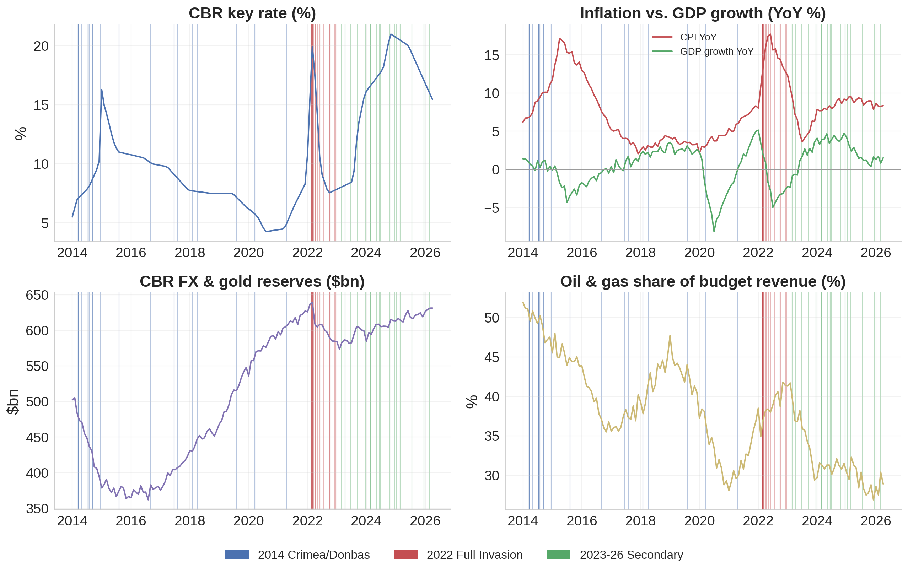
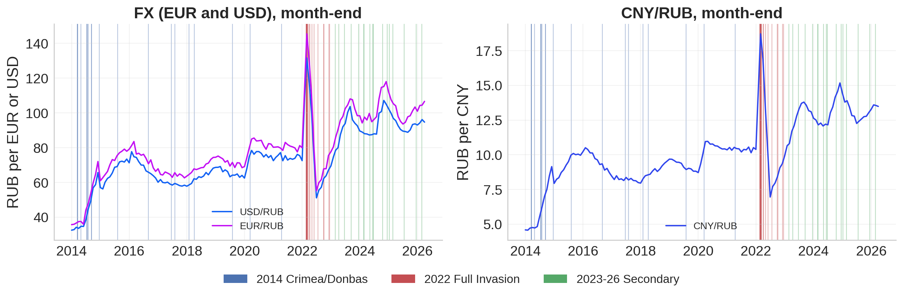
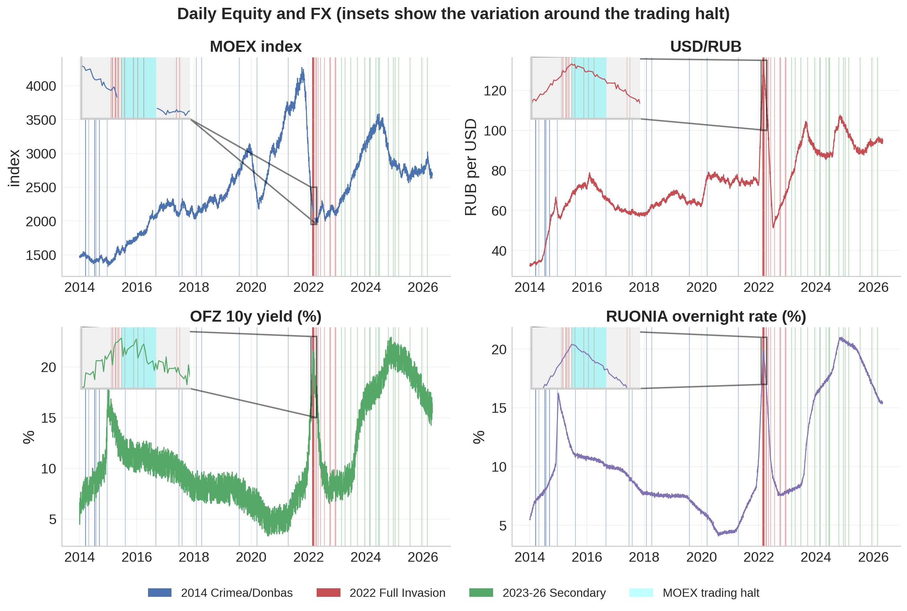
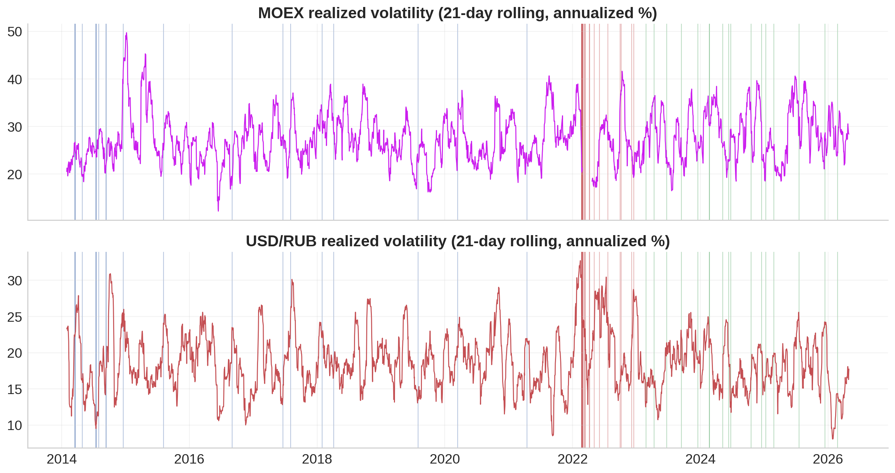
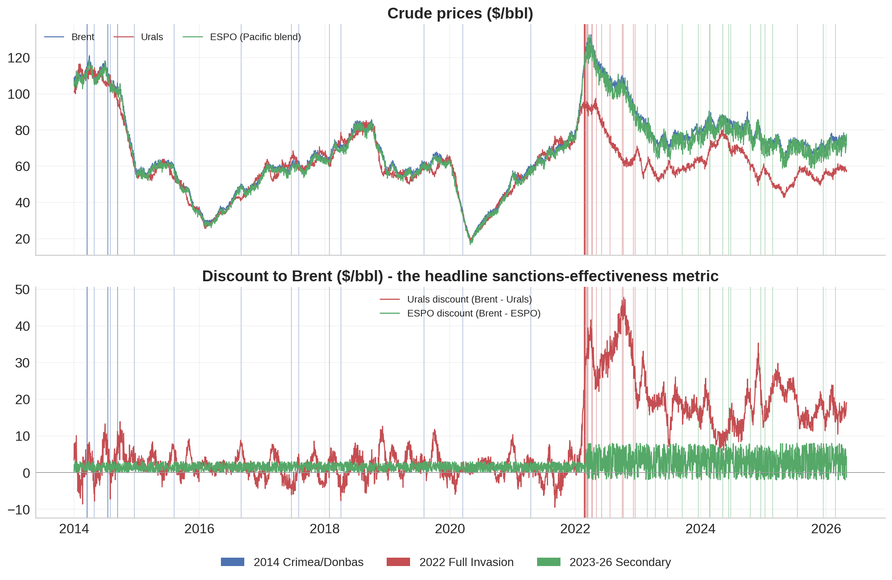
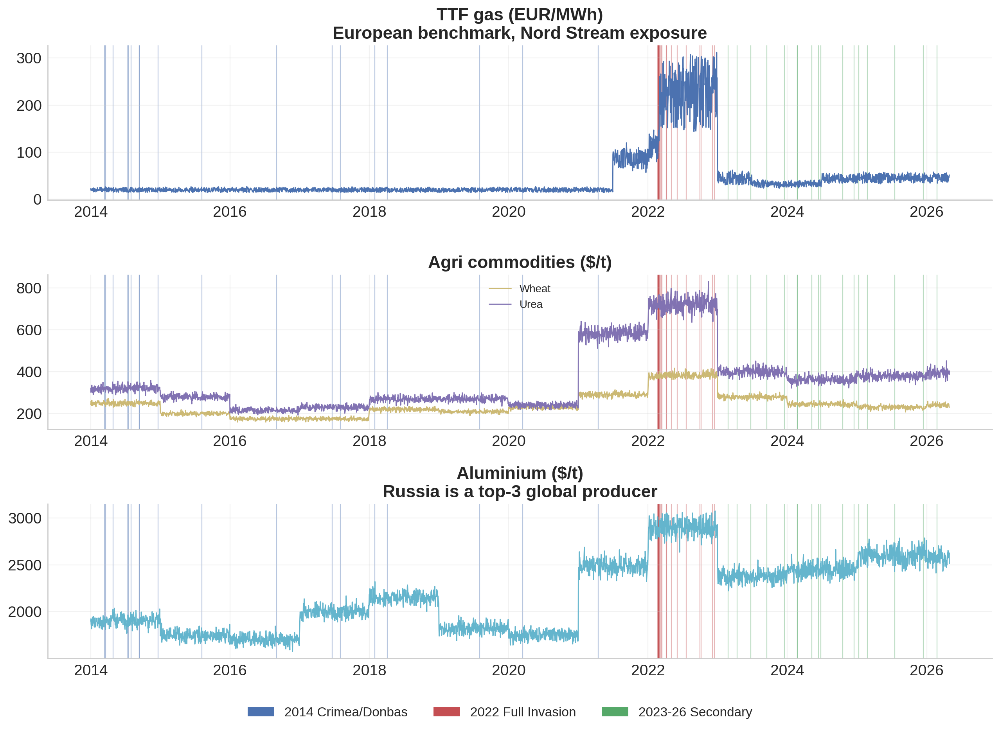
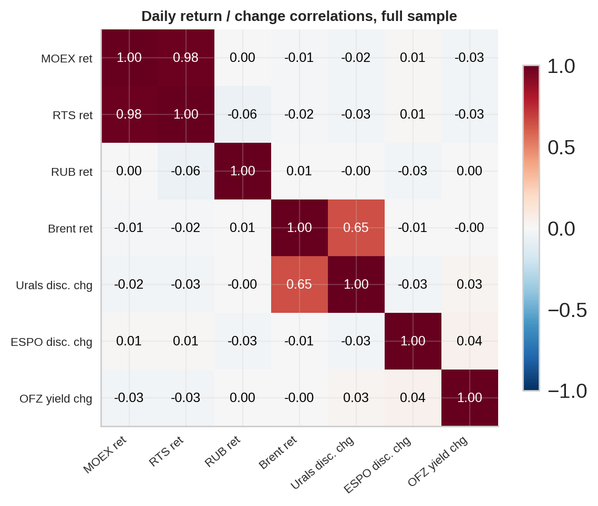
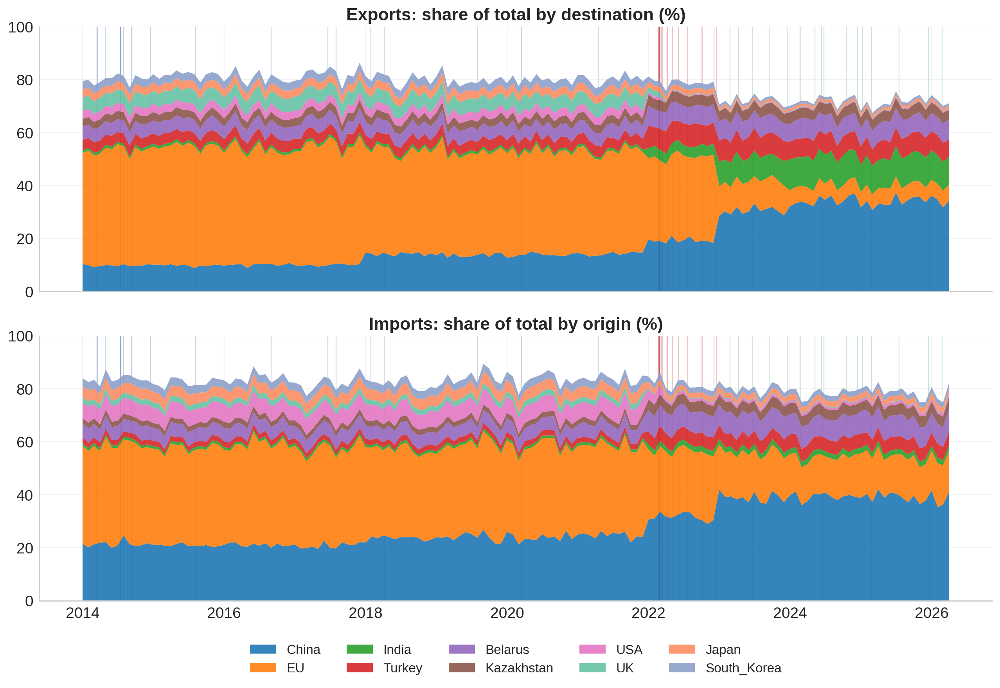
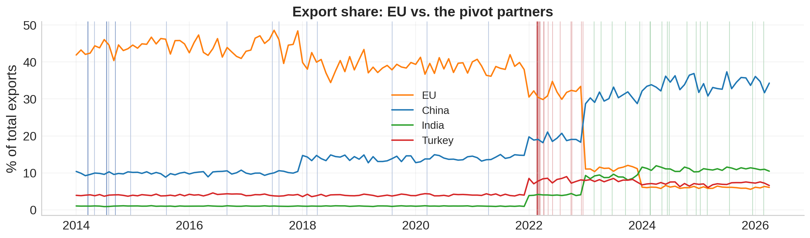
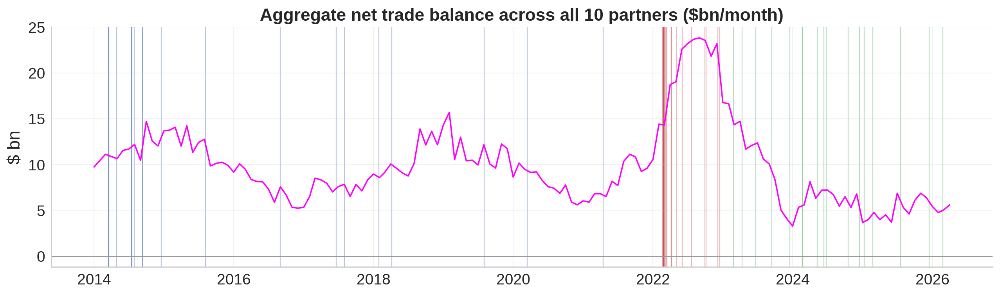

# **EDA Report: Russian Economy Under Sanctions, 2014–2026**

**Dataset:** 5 CSV files — `commodities_daily`, `equity_index_daily`, `macro_monthly`, `sanctions_events`, `trade_flows_monthly`  
**Date range:** January 2014 – April 2026  
**Analysis:** Exploratory Data Analysis

## 1. Dataset Overview
 
| File | Rows | Date range | Frequency | Nulls |
|------|------|-----------|-----------|-------|
| `commodities_daily.csv` | 3,217 | 2014-01-01 to 2026-04-30 | Business days | 0 |
| `equity_index_daily.csv` | 3,217 | 2014-01-01 to 2026-04-30 | Business days | 36 (MOEX/RTS only, see below) |
| `macro_monthly.csv` | 148 | 2014-01 to 2026-04 | Monthly | 0 |
| `sanctions_events.csv` | 60 | 2014-03-17 to 2026-02-24 | Event-driven | 0 |
| `trade_flows_monthly.csv` | 1,480 | 2014-01 to 2026-04 | Monthly × 10 partners | 0 |
 
**On the 36 nulls in equity data.** MOEX and RTS index values are missing on 18 trading days, exactly 2022-02-28 through 2022-03-23 — the real Moscow Exchange trading halt following the full-scale invasion. A `moex_trading_halted` flag marks these rows. This is not a data quality issue: these days had no observed market price. The event-study engine excludes NaN days from abnormal-return sums rather than imputing them.
 
---

## 2. Sanctions Events
 
### 2.1 Three waves, 60 events
 
| Wave | Events | Date range | Main jurisdictions |
|------|--------|-----------|-------------------|
| Wave 1 — Crimea/Donbas | 20 | Mar 2014 – Apr 2021 | US, EU |
| Wave 2 — Full invasion | 23 | Feb 2022 – Dec 2022 | US, EU, UK, G7+EU, Global |
| Wave 3 — Secondary | 17 | Feb 2023 – Feb 2026 | US, EU |

### 2.1 Distributions

- The total number of events in Wave 2 (in a single year 2022) is higher than those of Waves 1 and 3 (lasting several year) -> high sanction pressure in Wave 2.  
- Severity scores range from 2 to 10 (mean 6.2). Distribution peaks around score 6-7.   
- By jurisdictions, US (28) and EU (25) dominate over others.

---

## 3. Macro & Rates
 
The monthly `macro_monthly` file tracks the full arc of the Russian economy's response across three stress periods.

 

**CBR key rate:** Spiked from ~5.5% to ~16.5% in late 2014 (Crimea ruble crisis), fell gradually through 2016–2021 to a trough of ~4.5%, then surged to **~20%** in early 2022 following the invasion. It has come down since then but remains elevated relative to the pre-2022 baseline. It peaks again at **~21%** (the highest rate in the dataset) at late 2024.
 
**Inflation:** CPI YoY peaked at **~17.5%** in mid-2015 and mid-2022. GDP growth troughed at about **−5%** in the same windows. GDP growth also troughed at about **-8%** at mid-2020. By 2023, with GDP returns positive and CPI sits at moderating to high single digits.
 
**Reserves:** CBR reserves rises from 2015 to Feb 2022 from a reserves bottom around **$362bn**, and peaks at **~$643bn** (pre-invasion). The February 2022 reserve freeze caused a visible drop to **~580$bn** before a recovery. By 2025–2026 reserves are tracking near pre-invasion levels in the dataset.
 
**Oil & gas budget share:** Declined from ~50% in 2014 to <30% range by the end of 2020 (fiscal diversification effort), bounced sharply after the invasion (to the end of 2022), then trended down again as the price cap and energy-route reorientation took hold.

 
**FX:** USD/RUB and EUR/RUB peaked at >130 during the 2022 halt window, then fell back sharply to below 60 by mid-2022 — under mandatory FX conversion requirements before mean-reverting toward 90–120 in the dataset's later years. CNY/RUB follows a similar pattern (with lower exchange rates).

---

## 4. Equity & FX (Daily)

 
**MOEX:** Broadly trended from ~1500 in 2014 to >4000 by late 2021. The pre-halt close was 2,144; the reopening price on March 24 was 2,044 (−4.7% cumulative over the 18-day halt). The market has since recovered, and increases rapidly in 2023.
 
**USD/RUB:** It sharply peaks at early 2022 (invasion starting), then fell back sharply to below 60 by mid-2022.
 
**OFZ 10y / RUONIA:** Both rates spiked sharply in both major sanctions episodes. RUONIA (the overnight rate) closely tracked CBR policy, while the OFZ 10y yield spread over policy rate widened during stress periods, indicating sovereign-risk re-pricing beyond the rate hike itself.

 
**Realized volatility:** Full-sample annualized realized vol for MOEX averages **~27%**, peaking at **~50%** in early 2015. For USD/RUB the average is **~19%**, with the highest 21-day rolling vol (**~32%**) reached just before the trading halt in February 2022 as invasion risk was being priced in. Volatility spikes align visually with sanctions announcement clusters in both series.

 
---
## 5. Commodities

**Urals discount:** This is the single most direct barometer of sanctions effectiveness on the energy side, since it isolates the price Russia receives relative to the global benchmark.
 
| Period | Mean Urals discount to Brent | Median Urals discount to Brent | Std |
|--------|------------------------------|------------------------------|-----|
| Pre-invasion (2014-01 to 2022-02-23) | $1.87/bbl |$1.59/bbl | $3.55 |
| Post-invasion (2022-02-24 to 2026-04) | $20.93/bbl |$19.11/bbl | $8.07 |
 
The ~$19/bbl structural jump after the invasion reflects a combination of: EU oil embargo (Dec 2022 seaborne crude ban), G7 price cap at $60/bbl, loss of traditional European buyers, and the cost of routing oil to longer-haul Asian destinations through the shadow fleet. The ESPO blend (Russia's Pacific export) carries a smaller discount because it serves Chinese and Indian buyers less subject to Western secondary-sanctions pressure.

| Period | Mean ESPO discount to Brent | Median ESPO discount to Brent | Std |
|--------|------------------------------|------------------------------|-----|
| Pre-invasion (2014-01 to 2022-02-23) | $1.51/bbl |$1.53/bbl | $0.88 |
| Post-invasion (2022-02-24 to 2026-04) | $3.03/bbl |$2.98/bbl | $2.91 |

 
**Other commodities:** TTF gas (European benchmark) showed an extreme spike in 2022 as Nord Stream flows were cut, then fell sharply as LNG imports and demand destruction reduced European dependence. Wheat and urea — both areas where Russia is a top global supplier — saw elevated prices in 2022 but have since partially reverted. Aluminium (where Russia's Rusal is among the three largest global producers) reacted to the 2018 OLEG/RUSAL designation and again in 2022.

 
**Return correlations:** The daily return/change correlation matrix reveals that MOEX and RUB returns are almost uncorrelated with Brent. MOEX return is strongly correlated with RTS return. Notably, Urals discount is moderately correlated with Brent return (p=0.65). This return correlation will help in choosing the event-study model later.

---

## 6. Trade Reorientation

 
Ten bilateral partners are tracked monthly. The post-invasion reorientation is one of the starkest structural breaks in the entire dataset.
 
**Export shares:**
 
| Partner | Jan 2014 | Apr 2026 | Change |
|---------|---------|---------|--------|
| EU | 41.9% | 6.1% | −35.8 pp |
| China | 10.4% | 34.3% | +23.9 pp |
| India | 1% | 10.4% | +9.4 pp |
| Turkey | 3.9% | 6.6% | +2.7 pp |
 
The EU's near-complete collapse as an export destination for Russian goods (from 42% to 6%) is absorbed almost entirely by China and India — the two "pivot partners" that explicitly declined to join Western sanctions. Turkey plays a secondary but consistent role as both a direct buyer and a re-export hub.

 
Import-side reorientation is similarly dramatic: China went from ~21% of Russian imports (2014) to ~40%+ by 2026 as Western goods were (partially) replaced by Chinese equivalents.
 
The aggregate net trade balance (sum across all 10 partners) remains strongly positive throughout the dataset. Notably, it spikes during the Wave 2. After 2024, the net trade balance is slightly lower than that of pre-invasion period. 
 
---

