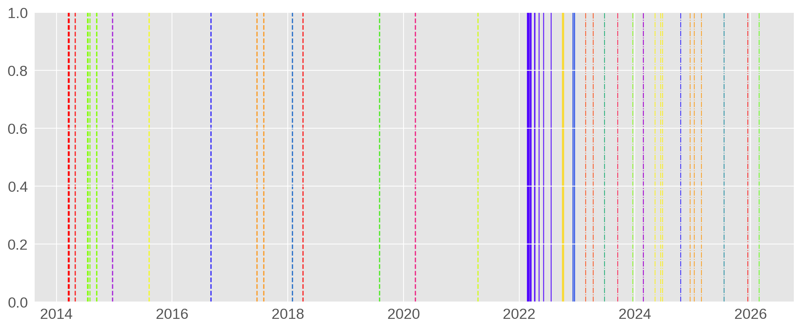

# Russia Sanctions 2014-2026: Event Study Analysis
<div style="text-align: justify;">

**Dataset:** 2 CSV files — `daily`, `sanctions`  
**Date range:** January 2014 – April 2026  
**Analysis:** Even Study Analysis

## 1. Event Definition

We are interested in the effect of *sanctions events* in the period from Jan 2014 to Apr 2026. For each event (or event cluster), the event window spans in the range $[T_2, T_3]$. We select following event window $[-10, +25]$. Cumulated abnormal return (see below) is estimated in the following sub-windows:
- `W_m2_5`: $[-1, +5]$
- `W_m2_10`: $[-1, +10]$
- `W_m2_25`: $[-1, +25]$
- `W_m5_5`: $[-5, +5]$
- `W_m5_10`: $[-5, +10]$
- `W_m5_15`: $[-5, +25]$
- `W_m10_5`: $[-10, +5]$
- `W_m10_10`: $[-10, +10]$
- `W_m10_25`: $[-10, +25]$


Note: 
- $(- x)$ -> $x$ trading days before the event -> information leakage 
- $(+ x)$ -> $x$ trading days after the event -> fast/slow reaction 

## 2. Event Clustering

There are 60 events in the dataset `sanctions`. They are not fully separated. To take into account this effect, we group the events into different event clusters. 
```
Given a cluster separation `GAP`,
1. If the separation between two events is not larger than `GAP`, they belong to the same cluster.
2. If e1 and e2 are in the same cluster, and e2 and e3 are in the same cluster, then e1 and e3 in the same cluster.
```     

We choose the `GAP` to be equal length of the event window (36). With the given criteria, 60 raw events are grouped into 25 episodes. In particular, there are

- 15 clusters containing 1 events, 
- 5 clusters containing 2 events,
- 2 clusters containing 3 events,
- 1 clusters containing 4 events,
- 1 clusters containing 6 events,
- 1 clusters containing 19 events.

In terms of waves, there are

- 11 clusters in Wave 1,
- 3 clusters in Wave 2 (the dense cluster with 15 events in the early stage of Wave 2),
- 11 clusters in Wave 3.

<center>

</center> 

(Legend: dashed - Wave 1, solid - Wave 2, dash-dotted-Wave 3)

The resulted clusters are saved in the file `clusters.csv`

## 3. Estimation Window and other eras in a nutshell

<div style="text-align: center;">
---T0_______________________T1___T2_______Ts==cluster==Te___________T3--->
</div>

- Event cluster spans from $T_s$ to $T_e$ (inclusive).
- Event window spans from $T_2$ to $T_3$ (inclusive): $T_2$ counting from $T_s$, and $T_3$ counting from $T_e$. EventW length: $L_2$ days. 
- $[T_0, T_1]$ is the ***estimation window*** to estimate the parameters of the event study model (see below); $T_0$ and $T_1$ are the number of days before the cluster (counting from $T_s$). Estimation window length: $L_1$.
- The separation between $T_1$ and $T_2$ is called *buffer*.

The buffer is chosen to be 5 days (to avoid possible further information leakage). $T_0$ is estimated in such a way that the number of estimated points (trading days) is 150. This number can be tuned, typically from 120 to 250, but not to be small (the chosen below threshold is 60). In any case, the estimation window must precede, and not overlap, the event window. The event-free return behavior is assumed in this window.

We also exclude the event windows of other events (possibly plus some buffers) when estimating $T_0$ to avoid the contamination of other events.

## 4. Normal and Abnormal Return (AR) Calculations
Formulation:
$$
AR_{it} \equiv \epsilon_{it} = R_{it} - \mathbb{E}[R_{it}|R_{mt}]
$$
where:
- $R_{it}$: the actual return of the asset $i$ at day $t$. It is assumed to be normally distributed.
- $\mathbb{E}[R_{it}|R_{mt}]$: the expected (normal) return of $i$ given the conditioning information for normal performance $R_{mt}$ -> need modeling
- $\epsilon_{it}$ (or $AR_{it}$) is the abnormal return. $\epsilon_{it} \sim \mathcal{N}(0,\sigma_{\epsilon_i}^2)$

We employ the **market model** for this event study. This model assumes
$$
\mathbb{E}[R_{it}|R_{mt}] = \alpha_i + \beta_i R_{mt},
$$
where $\alpha_i$ and $\beta_i$ are parameters to estimate. When $\beta_i = 0$, the model becomes the **constant-mean model**. $R_{mt}$ is supposed to moderately to strongly correlate with $R_{mt}$, but not too strong ($corr \ge 0.9$) to avoid multi-collinearity.

In this analysis, we focus on the following market assets for $R_i$: **MOEX return**, **RUB return**, and **Urals discount change**.

From the EDA, one cannot find (from the given dataset) a market return factor that has a non-negligible (but not very strong) correlation with MOEX and RUB returns. This means that no available return factor has any predictive power. Therefore, for these two returns, the constant-mean-model is employed.

Meanwhile, the correlation index between the Urals discount change and the Brent return is 0.65. This means that Brent return brings a genuine explanatory power to the Urals discount change. Therefore, in this case, the full market model is applied. The parameters $\alpha_i$ and $\beta_i$ are determined by fitting to the data in the estimation window using the ordinary least square (OLS).

## 5. Cumulated Abnormal Return and Statistical Testing

Cumulated abnormal return (CAR) over a sub-window of length $L_c$

$$
CAR = \sum_{i=1}^{L_c} AR_t
$$

**Underlying Question**: Does the considered sanction episode produce a return that would not be expected under business-as-usual? (i.e., does event matter?)

*Null hypothesis*: Event cluster has no effect (pure noise)
$$
H_0: E[CAR] = 0
$$ 

*Alternative hypothesis*: Event cluster present an effect
$$
H_1: E[CAR] \neq 0
$$ 

**t-statistics:**

$$
t=\frac{CAR}{SE}
$$
where:
$$
SE = \sigma \sqrt{L_2\left(1+\frac{L_2}{L_1}\right)},\\
\sigma^2 = \rm{estimation-window~ residual~ variance}
$$

$L_1:$ length of the estimation window  
$L_2:$ length of CAR window

**P-value (two-sided test):**

$$
p = 2\big[ 1-F_t(|t|,\nu) \big]
$$
where $F_t(|t|,\nu)$ is the Student's t CDF with dof $\nu = L_1 - K$ (where K is the number of estimated parameters)

For large $\nu$, $F_t(|t|,\nu) \to \Phi(|t|)$ (normal CDF).


</div>