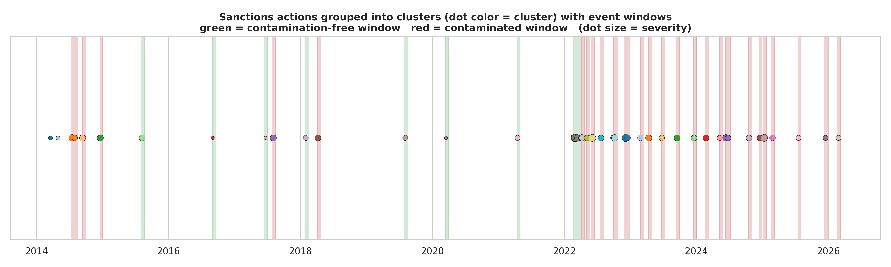
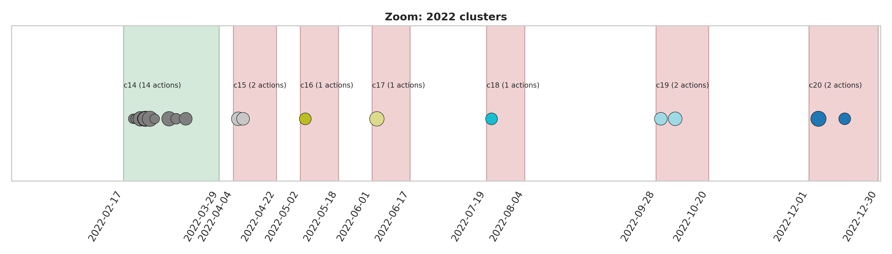
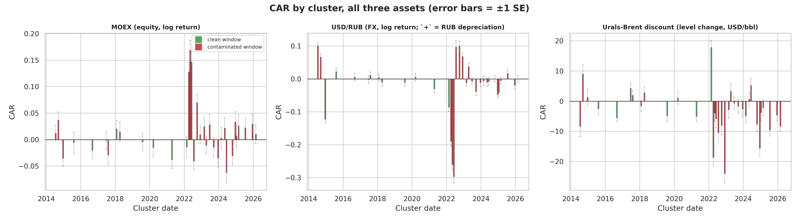
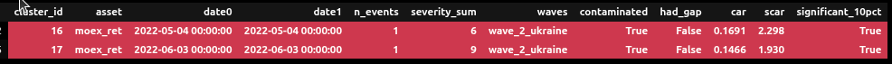
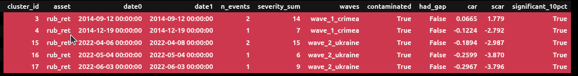
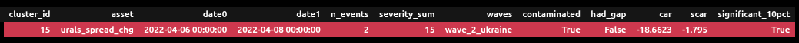
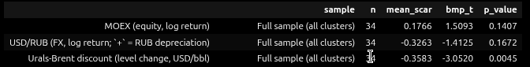

# Russia Sanctions 2014-2026: Event Study Analysis
<div style="text-align: justify;">

**Dataset:** 2 CSV files — `daily`, `sanctions`  
**Date range:** January 2014 – April 2026  
**Analysis:** Even Study Analysis

**Goal:** Quantify the impact of specific sanctions events on MOEX (equity), USD/RUB
(FX), and the Urals-Brent discount, using standard event-study methodology, while
explicitly handling **event clustering** and **event-window contamination**.

**Methodology:** 
- ***Clustering.*** Sanctions actions within CLUSTER_GAP trading days of each other are merged into a single event *cluster*. Treating
overlapping actions as separate events would multiple-count the same market reaction.

- ***Normal-return model.*** Constant-mean-return model (Brown & Warner, 1985): the expected daily change is the mean of that asset's own change over a prior estimation window. This is preferred here over a single-factor "market model" because there is no clean, uncorrelated benchmark for MOEX/RUB/Urals-discount simultaneously; using Brent as a factor for the Urals-Brent *spread* would be circular since Brent is already netted out of that variable by construction

- ***Windows.*** Estimation window: **[-120, -21]** trading days before the cluster anchor date. The 21-day gap avoids pre-announcement leakage/anticipation contamination.    
    Event window: **[-2, +10]** trading days around it $\to$ to measure the abnormal reaction.  
    `CLUSTER_GAP` is chosen to be equal to the width of the event window.


- ***Contamination handling.***
   - A cluster is flagged **contaminated** if another cluster's anchor date falls
     inside its combined estimation+event span.
   - Independent of that flag, the **estimation window itself is cleaned**: any day
     that falls inside a *different* cluster's event window is dropped before the
     mean/variance of "normal" returns is estimated, so the normal-return model is
     never fit on days that are themselves a different shock.
   - Results are reported for the **full sample** and, separately, for the
     **contamination-free subsample only**, as a robustness check.
- ***Statistics.***
   - Per-cluster: standardized CAR, $SCAR = CAR / (σ_{est} \sqrt{L_2(1+L_2/L_1)})$, tested as
     approximately t-distributed (Brown & Warner).
   - Across clusters: the **Boehmer–Musumeci–Poulsen (1991) cross-sectional test**,
     which standardizes each event by its own estimation-period volatility before
     averaging — robust to sanctions events increasing volatility (an
     event-induced-variance problem that a naive pooled t-test would get wrong).
- ***Data gap.*** MOEX was actually **halted** 2022-02-28 to 2022-03-23. CAR is
   computed from price *levels* (not summed daily returns), so the event-window
   endpoint automatically rolls forward to the first price observed once trading
   resumes — this avoids silently truncating the largest shock in the sample.


## 1. Event Clustering

There are 60 events in the dataset `sanctions`. They are not fully separated. To take into account this effect, we group the events into different event clusters. This avoids treating overlapping shocks as independent events.

```
Given a cluster separation `CLUSTER_GAP`,
1. If the separation between two events is not larger than `CLUSTER_GAP`, they belong to the same cluster.
2. If e1 and e2 are in the same cluster, and e2 and e3 are in the same cluster, then e1 and e3 in the same cluster.
```
With `CLUSTER_GAP = 13`, there are 36 clusters. Among them,
- 14 clusters in Wave 1
- 7 clusters in Wave 2
- 15 clusters in Wave 3 

<center>


</center>

Notes:
- Sanctions become frequent post-2022.
- Almost every window post-2022 is red (contaminated), while the sparser 2014-2021 actions are mostly green (clean).
- Mega-cluster c14 with 14 sanctions events 

## 2. Normal and Abnormal Return (AR) Calculations
Formulation:
$$
AR_{it} \equiv \epsilon_{it} = R_{it} - \mathbb{E}[R_{it}|R_{mt}]
$$
where:
- $R_{it}$: the actual return of the asset $i$ at day $t$. It is assumed to be normally distributed.
- $\mathbb{E}[R_{it}|R_{mt}]$: the expected (normal) return of $i$ given the conditioning information for normal performance $R_{mt}$ -> need modeling
- $\epsilon_{it}$ (or $AR_{it}$) is the abnormal return. $\epsilon_{it} \sim \mathcal{N}(0,\sigma_{\epsilon_i}^2)$

We employ the **market model** for this event study. This model assumes
$$
\mathbb{E}[R_{it}|R_{mt}] = \alpha_i + \beta_i R_{mt},
$$
where $\alpha_i$ and $\beta_i$ are parameters to estimate. When $\beta_i = 0$, the model becomes the **constant-mean model**. $R_{mt}$ is supposed to moderately to strongly correlate with $R_{mt}$, but not too strong ($corr \ge 0.9$) to avoid multi-collinearity.

In this analysis, we focus on the following market assets for $R_i$: **MOEX return**, **RUB return**, and **Urals discount change**.

From the EDA, the ***constant-mean-model*** is employed.

## 3. Cumulated Abnormal Return and Statistical Testing

Cumulated abnormal return (CAR) over a sub-window of length $L_c$

$$
CAR = \sum_{i=1}^{L_c} AR_t
$$

**Underlying Question**: Does the considered sanction episode produce a return that would not be expected under business-as-usual? (i.e., does event matter?)

<center>

</center>

*Null hypothesis*: Event cluster has no effect (pure noise)
$$
H_0: E[CAR] = 0
$$ 

*Alternative hypothesis*: Event cluster present an effect
$$
H_1: E[CAR] \neq 0
$$ 

**SCAR or t-statistics:**

$$
t=\frac{CAR}{SE}
$$
where:
$$
SE = \sigma \sqrt{L_2\left(1+\frac{L_2}{L_1}\right)},\\
\sigma^2 = \rm{estimation-window~ residual~ variance}
$$

$L_1:$ length of the estimation window  
$L_2:$ length of CAR window

**P-value (two-sided test):**

$$
p = 2\big[ 1-F_t(|t|,\nu) \big]
$$
where $F_t(|t|,\nu)$ is the Student's t CDF with dof $\nu = L_1 - K$ (where K is the number of estimated parameters)

For large $\nu$, $F_t(|t|,\nu) \to \Phi(|t|)$ (normal CDF).

**Results:**

<center>

</center

<center>>

</center>

<center>

</center>

- For MOEX return, two Clusters 16 and 17 in Wave 2 have large-enough abnormal reaction in magnitude to fall outside the ±10% critical bounds of the t-distribution. This means the observed CARs for these two clusters is statistically distinguishable from zero at the 10% significance level $\to$ the price move is probably a real reaction to sanctions.

- For RUB return, 5 Clusters 3, 4, 15, 16, and 17 have the observed CAR statistically distinguishable from zero at the 10% significance level $\to$ the FX move is probably a real reaction to sanctions.
 
- For Urals discount change, only Cluster 15 has the observed CAR statistically distinguishable from zero at the 10% significance level $\to$ the discount move is probably a real reaction to sanctions.


## 4. Cross-sectional (BMP) tests

<center>

</center>

- MOEX (equity): mean_scar = 0.177 (positive, i.e. slight average rise), but p = 0.14. So, one cannot reject "no average abnormal MOEX reaction to sanctions clusters".
- USD/RUB: mean_scar = -0.326 (negative, meaning average abnormal RUB appreciation/strengthening), but p=0.17 $\to$ not significant
- Urals-Brent discount: mean_scar = -0.358, bmp_t = -3.05, p = 0.0045 $\to$ genuinely significant.


</div>
